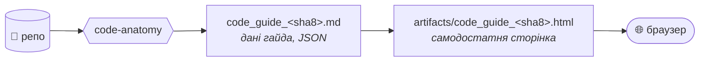
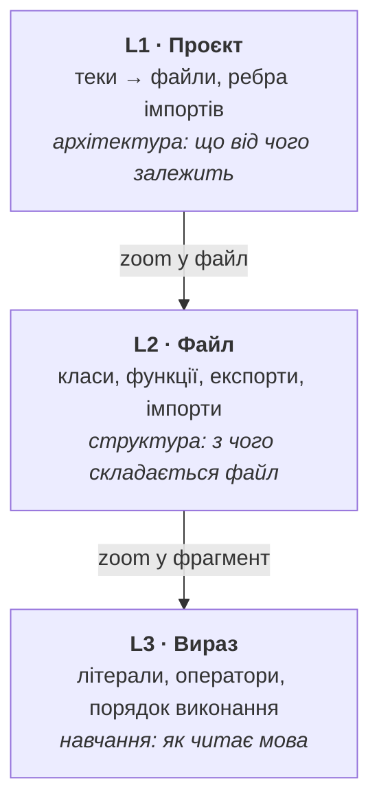
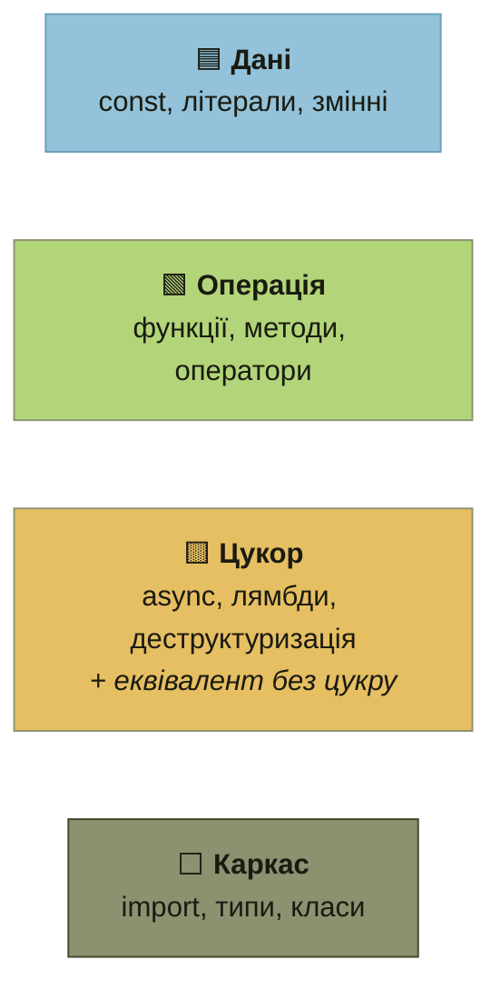

# code-anatomy

Анатомія коду: скіл розбирає репозиторій на **блоки чотирьох типів** і показує,
**в якому порядку мова реально виконує** фрагмент. Особливо там, де вона читає код не так,
як людина: hoisting, коерція, static-ініціалізація, логічний порядок SQL.



## Три рівні, як у C4

Від загальної картини до одного виразу, як зум на карті:



| Рівень | Що показує | Навіщо |
|---|---|---|
| **L1** Проєкт | теки → файли, ребра імпортів | бачиш архітектуру, як у CodeSee |
| **L2** Файл | класи, функції, експорти, імпорти | бачиш, з чого складається файл |
| **L3** Вираз | до 3 фрагментів: вхідна точка, найбільше цукру, найбільша пастка | бачиш порядок, у якому мова виконує код |

## Чотири типи блоків

Кожен елемент коду належить рівно до одного типу. Кольори ті самі, що в HTML-гайді (темна тема):



## Приклад: як мова читає `checkout.ts`

```ts
import { Item } from "./types";
export const TAX_RATE = 0.2;
export async function calculateTotal(items: Item[]) {
  const subtotal = items.reduce((sum, i) => sum + i.price, 0);
  return subtotal * (1 + TAX_RATE);
}
```

Людина читає файл зверху вниз. Мова виконує його в іншому порядку:

```mermaid
flowchart LR
    subgraph M["Завантаження модуля"]
        direction LR
        m1["1 · import Item<br/><i>зв'язується до виконання</i>"]:::struct
        m2["2 · calculateTotal<br/><i>піднята: існує до рядка 2</i>"]:::op
        m3["3 · TAX_RATE = 0.2"]:::data
        m1 --> m2 --> m3
    end
    subgraph F["Виклик calculateTotal(items)"]
        direction LR
        f1["f1 · стрілка<br/>(sum, i) => …"]:::sugar
        f2["f2 · літерал 0"]:::data
        f3["f3 · reduce"]:::op
        f4["f4 · sum + i.price<br/><i>number + number</i>"]:::op
        f5["f5 · subtotal"]:::data
        f6["f6 · 1 + TAX_RATE"]:::op
        f7["f7 · return"]:::op
        f8["f8 · async<br/><i>загортає в Promise</i>"]:::sugar
        f1 --> f2 --> f3 --> f4 --> f5 --> f6 --> f7 --> f8
    end
    M --> F
    classDef data fill:#93C2DA,stroke:#6A9FBC,color:#1A1B11
    classDef op fill:#B3D57A,stroke:#8E9170,color:#1A1B11
    classDef sugar fill:#E6BF63,stroke:#8E9170,color:#1A1B11
    classDef struct fill:#8E9170,stroke:#44472A,color:#1A1B11
```



Що тут неочевидно:
- **f1 → f2 → f3.** Аргументи `reduce` обчислюються *до* самого виклику: спершу створюється стрілка, потім літерал `0`.
- **f8.** `async` спрацьовує останнім. `return` віддає число, і тільки потім воно загортається в `Promise`.
- **Анотація `items: Item[]`** не має номера. Це каркас, який зникає після компіляції й на виконання не впливає.

Повний розбір цього файлу з JSON, який пише скіл: [`worked_example.md`](skills/code-anatomy/references/worked_example.md).

## Мови

JS/TS з Node.js · Python · Go · Java · SQL · MongoDB

## Встановлення

```
/plugin marketplace add <шлях або URL цього репо>
/plugin install code-anatomy@code-anatomy
```

## Як користуватись

«зроби візуальний гайд по цьому репо», «поясни проєкт блоками», «як читає ця мова цей файл».

Скіл пише `code/<репо>/code_guide_<sha8>.md` (джерело) і поруч самодостатній HTML у
`artifacts/`. HTML рендериться в браузері, тож ні Node, ні Python на машині не потрібні.
Тека `code/` лежить у `.gitignore`: гайди належать тому, хто їх згенерував, а не цьому репо.

У HTML граф L1 інтерактивний (зум, клік на модуль, пошук), а L3 — покроковий програвач
порядку виконання; тема темна, світла — кнопкою в шапці.

### Де зберігаються візуали

Під час першого збереження скіл один раз питає, куди складати всі гайди й HTML: тека,
Google Drive або ніде. Відповідь він записує у файл налаштувань, спільний для обох скілів
і всіх проєктів, і більше не питає:

| Агент | Файл |
|---|---|
| Claude Code | `~/.claude/code-anatomy.json` |
| Codex | `~/.codex/code-anatomy.json` |
| інший | `~/.config/code-anatomy.json` |

```json
{ "storage": "local", "path": "D:/guides" }
```

Скіл читає всі три файли, тож відповідь, дана в одному агенті, діє в інших на тій самій машині.
Змінити теку: скажи «зміни сховище».

## Зміни коміту: code-anatomy-diff

Другий скіл у плагіні показує, що змінив коміт або діапазон `A..B`: ті самі три рівні, але
лише для змінених місць і двома колонками — БУЛО | СТАЛО, з позначками `+ − ~`.

«візуалізуй зміни коміту», «покажи що було і що стало», «розклади diff HEAD~3..HEAD блоками».

Пише `code/<репо>/code_diff_<to8>.md` і `artifacts/code_diff_<to8>.html`; повний гайд не затирає.

## Для того, хто править скіл

Змінив рендерер, шаблон або таблицю форм, прожени:

```
node --test skills/code-anatomy/references/test_render_guide.mjs
node --test skills/code-anatomy-diff/references/test_render_diff.mjs
```

Потрібен Node 18+, без npm.

## Ліцензія

MIT
